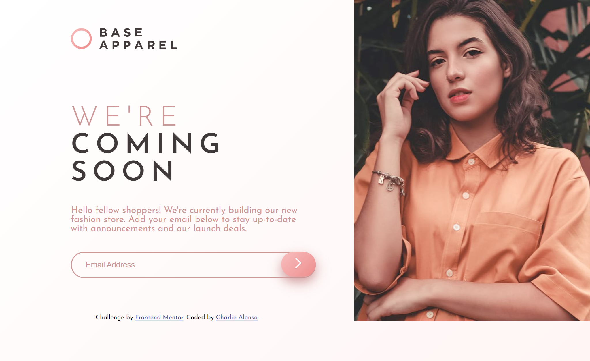

# Frontend Mentor - Base Apparel coming soon page solution

This is a solution to the [Base Apparel coming soon page challenge on Frontend Mentor](https://www.frontendmentor.io/challenges/base-apparel-coming-soon-page-5d46b47f8db8a7063f9331a0). Frontend Mentor challenges help you improve your coding skills by building realistic projects. 

## Table of contents

- [Frontend Mentor - Base Apparel coming soon page solution](#frontend-mentor---base-apparel-coming-soon-page-solution)
  - [Table of contents](#table-of-contents)
  - [Overview](#overview)
    - [The challenge](#the-challenge)
    - [Screenshot](#screenshot)
    - [Links](#links)
  - [My process](#my-process)
    - [Built with](#built-with)
    - [What I learned](#what-i-learned)
    - [Continued development](#continued-development)
    - [Useful resources](#useful-resources)
  - [Author](#author)

**Note: Delete this note and update the table of contents based on what sections you keep.**

## Overview

### The challenge

Users should be able to:

- View the optimal layout for the site depending on their device's screen size
- See hover states for all interactive elements on the page
- Receive an error message when the `form` is submitted if:
  - The `input` field is empty
  - The email address is not formatted correctly

### Screenshot

### Links

- Solution URL: [base-apparel-coming-soon-page respository](https://github.com/Charlie025x/base-apparel-coming-soon-page)
- Live Site URL: [base-apparel-coming-soon-page](https://charlie025x.github.io/base-apparel-coming-soon-page/)

## My process

### Built with

- CSS custom properties
- Flexbox
- CSS Grid
- Mobile-first workflow

### What I learned

This project was a good CSS grid refresher. I first created the project's mobile version using flexbox but then making the desktop version with flexbox was difficult. So I re-wrote my css with Grid, development went smoothly for the most part after that. For a moment the mobile website would break when I added a second "column" using "grid-template-column: 60% 30%" at the desktop's media query. I have no idea as to why that happened but I somehow fixed that bug.

### Continued development

Identifying whether to use flex or grid, keeping in mind how the web site changes from mobile to desktop size.

### Useful resources

- [The Explicit and Implicit grid explained - Kevin Powell, YouTube](https://youtu.be/cMWnIX3ukLI) - Very usefull refrence video for working with CSS Grid.
- [reset css 2021](https://www.codegrepper.com/code-examples/css/reset+css+2021) - A css reset stylesheet I like to use.

## Author

- Website - [Charlie Alonso](https://charlie-alonso.netlify.app/)
- GitHub - [Charlie025x](https://github.com/Charlie025x)
- Frontend Mentor - [@Charlie025x](https://www.frontendmentor.io/profile/Charlie025x)
- LinkedIn - [Charliealonso002](https://www.linkedin.com/in/charliealonso002/)